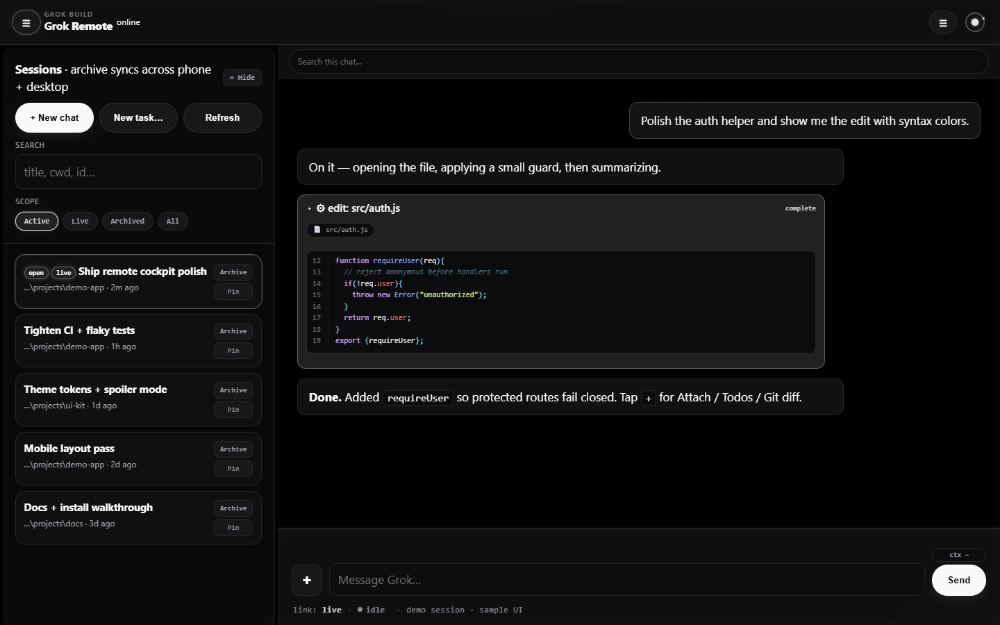
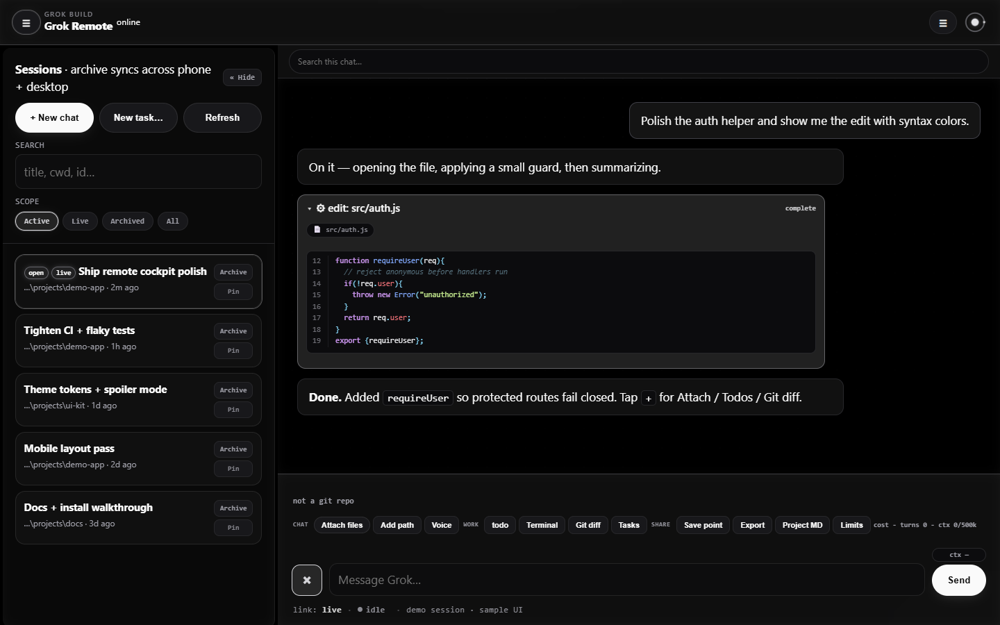
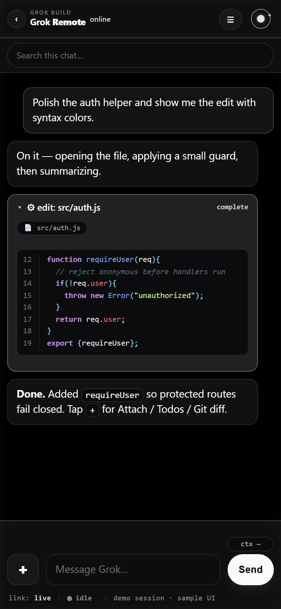

# Grok Remote

**Live phone/browser controller for [Grok Build](https://x.ai)** — drive your PC agent from Android or any browser on the same network.

[](./LICENSE)

| | |
|---|---|
| **Repo** | https://github.com/Amnibro/grok-remote |
| **Plugin** | `/remote` · `/remote-stop` · `/remote-autostart` |
| **Default theme** | Grok (full greyscale) · dark |

---

## Install

```bash
grok plugin install Amnibro/grok-remote --trust
grok plugin enable grok-remote
```

Pin a release:

```bash
grok plugin install Amnibro/grok-remote@v1.1.0 --trust
```

In the TUI, reload plugins if needed (`/plugins` → `r`), then:

```
/remote
```

Open the printed URL on your phone (same Wi‑Fi), e.g. `http://192.168.x.x:2421/?auto=1`.

---

## Screenshots

Sample session UI (demo data — no real chats or machine paths). Grok greyscale; tool cards show syntax-colored code.

### Desktop chat



### Composer tools (`+`)



### Menu


### Setup / themes


### Phone

| Chat | Spoiler mode |
|------|----------------|
|  |  |

**Spoiler** blurs session titles, paths, and IDs for safe sharing. Desktop: hold **Alt** to peek. Phone: **private screen** (no Alt).

Regenerate captures (local UI on `:2421`):

```bash
node scripts/capture-screenshots.mjs
```

---

## Features

| Feature | Detail |
|---------|--------|
| Session picker | List + load desktop / historical chats (`live` = resident) |
| Full history | Messages, thinking, tools, plans on load |
| Live stream | ACP updates + disk catch-up for PC-side prompts |
| Composer tools | Attach files, add path, voice, todos, terminal, git diff, export |
| Skills | Slash-command palette |
| New Task | New session at a cwd + optional first prompt |
| Themes | Grok greyscale default + product accents + fun skins × light/dark |
| Spoiler | Privacy blur for screenshots |
| Diff UX | Inline hunks; Accept applies via FS API |
| Code in tools | Line numbers + syntax colors in reads/edits/output |
| Permissions | One-tap allow/deny + Always for session |
| Desktop app | Electron cockpit + IDE + Grok Review (optional) |

---

## Manual start

```powershell
cd path\to\grok-remote
.\start.ps1 -Cwd path\to\your\project
```

## Architecture

```
Phone browser  --HTTP-->  UI+proxy :2421
               --WS /ws-->  (proxy) --> grok agent serve 127.0.0.1:2419
                                              │
                                         tools / files on PC
```

## Desktop app (Electron)

Optional cockpit that starts agent + UI, with built-in IDE and Grok Review.

```powershell
cd desktop
npm install
npm start
```

Details: [desktop/README.md](./desktop/README.md)

## Auto-start (optional)

```powershell
powershell -File .\scripts\install-autostart.ps1 -Cwd path\to\project
powershell -File .\scripts\install-autostart.ps1 -Boot -Cwd path\to\project
powershell -File .\scripts\install-autostart.ps1 -Disable
```

Or in TUI: `/remote-autostart on` · `boot` · `off` · `status`

Config: `~/.grok/plugin-data/grok-remote/config.json` (default **off**).

## Safety

- Prefer same Wi‑Fi / VPN; don’t expose the agent to the open internet without care.
- Never `Stop-Process -Name grok` (kills every Grok session on the machine).
- `/remote-stop` only stops remote UI + remote agent serve.

## Develop

```powershell
# UI + hub (serves web/ from this repo)
.\start.ps1 -Cwd .
# Screenshots
node scripts/capture-screenshots.mjs
```

See [CONTRIBUTING.md](./CONTRIBUTING.md) and [architecture_map.md](./architecture_map.md).

## License

MIT — see [LICENSE](./LICENSE).

## Docs

- [PUBLISH.md](./PUBLISH.md) — plugin install & marketplaces  
- [skills/remote/SKILL.md](./skills/remote/SKILL.md) — `/remote` skill  
