# Grok Remote

**Drive [Grok Build](https://x.ai) from your phone or browser** — live sessions, tools, history, and control on the same network as your PC.

[](./LICENSE)
[](https://github.com/Amnibro/grok-remote/releases)
[](#themes)

| | |
|---|---|
| **Repo** | https://github.com/Amnibro/grok-remote |
| **Plugin** | `/remote` · `/remote-stop` · `/remote-autostart` |
| **Default theme** | **Grok** (full greyscale) · dark |
| **Safe demo** | `http://host:2421/?demo=1` — no real chats, no agent |
| **Companion** | Optional `/xr` hologram — off until Settings → Apps → Companion |
| **License** | MIT |

Companion model: [High Poly Rikku](https://skfb.ly/pIrZ9) by HumanContraband, CC BY 4.0. Clip JSON under `clips/` is Mixamo-baked motion for that rig.

<p align="center">
  
</p>

<p align="center"><sub>Desktop · Grok theme · demo data only</sub></p>

---

## Companion (`/xr`)

Opt-in hologram in your room (Quest browser or Preview on a 2D screen). Turn it on from **Settings → Apps → Companion**, then **Open companion** or the composer **XR** chip. **Remote** in the overlay returns to the text UI. Motion service is `motion_service.py` on port 2423.

```bash
python motion_service.py
```

---

## Install

```bash
grok plugin install Amnibro/grok-remote --trust
grok plugin enable grok-remote
```

Pin a release:

```bash
grok plugin install Amnibro/grok-remote@v1.3.0 --trust
```

In the TUI, reload plugins if needed (`/plugins` → `r`), then:

```
/remote
```

Open the printed URL on your phone (same Wi‑Fi), e.g. `http://192.168.x.x:2421/?auto=1`.

---

## Product tour

All images below use **`?demo=1`** sample sessions (titles like *Ship remote cockpit polish*) — **not** personal chats or real paths.

### Desktop cockpit (Grok)

Sessions rail + live feed + composer. Tool cards show syntax-colored edits.


### Command deck (☰)

Top-right control opens the **Command deck**: Skills, New task, delivery mode, permission cycle, **Tools** (Todos / Terminal / Git / Export…), hide/collapse grids, apps, theme, tour.

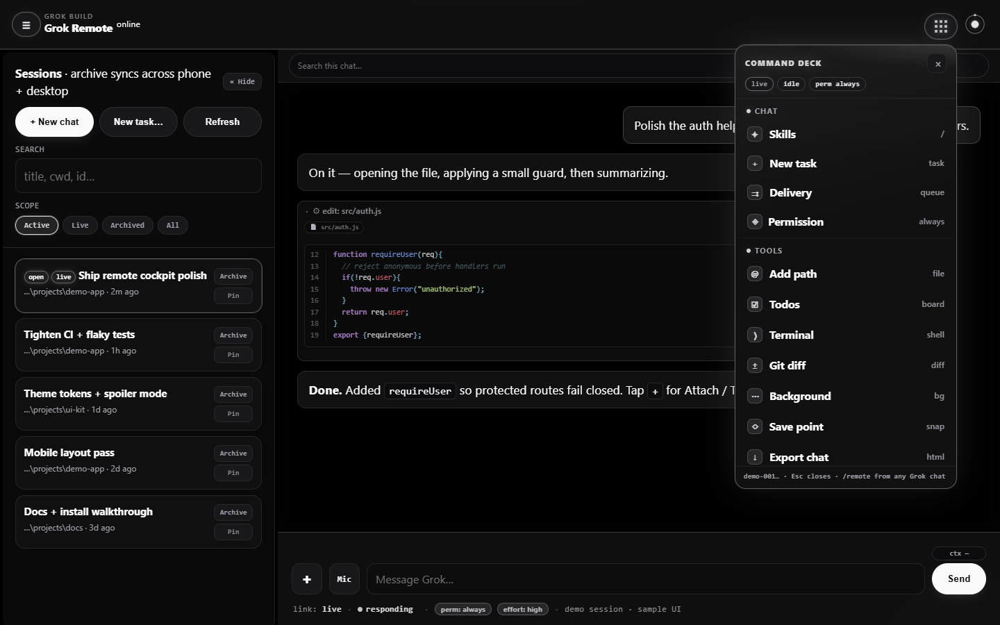

### Special tools in the deck

Scroll the deck for specials — path attach, todos, terminal, git diff, export. (Composer **+** is attach-only.)

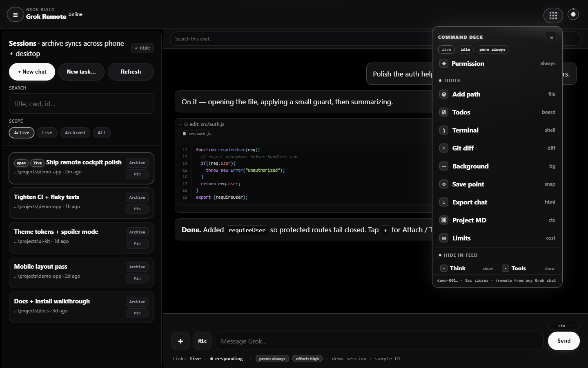

### Link control (orbit)

Planet control: **Start server**, **Stop remote**, health — without killing your desktop TUI.

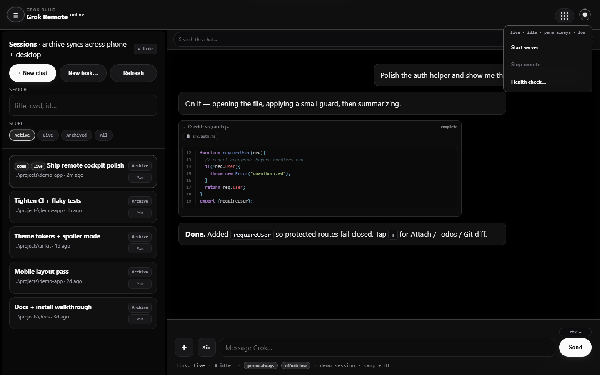

### Skills & slash commands

Skills sheet merges agent commands + disk skills. Remote also intercepts **`/effort`** and **`/loop`** (hub scheduler — no CLI window required).

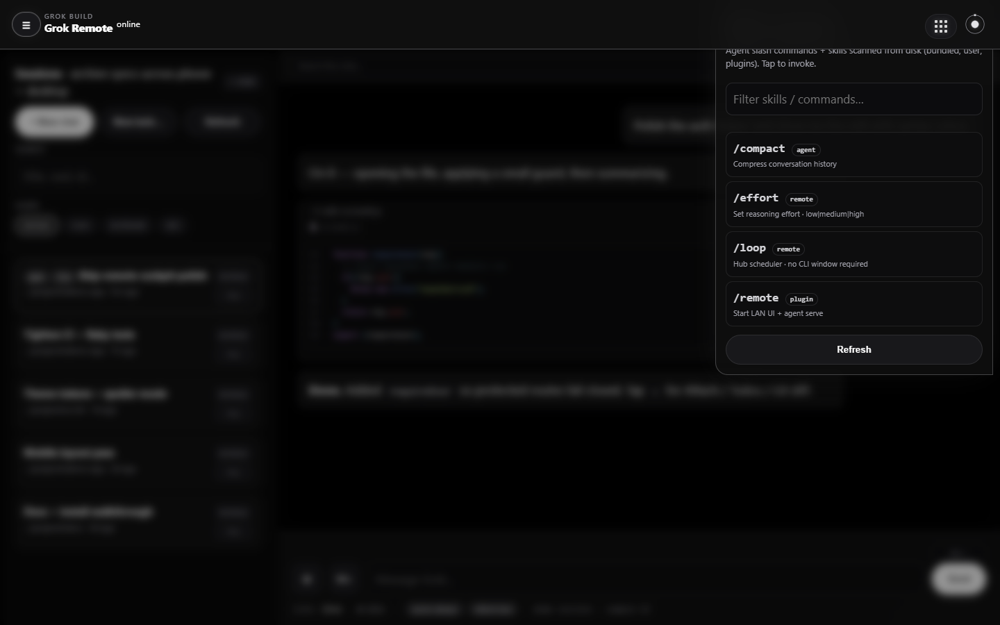

### Setup & theme gallery

Pick Grok, product accents, or fun skins × light/dark.

| Grok (default) | Amni-Scient | Matrix |
|----------------|-------------|--------|
| 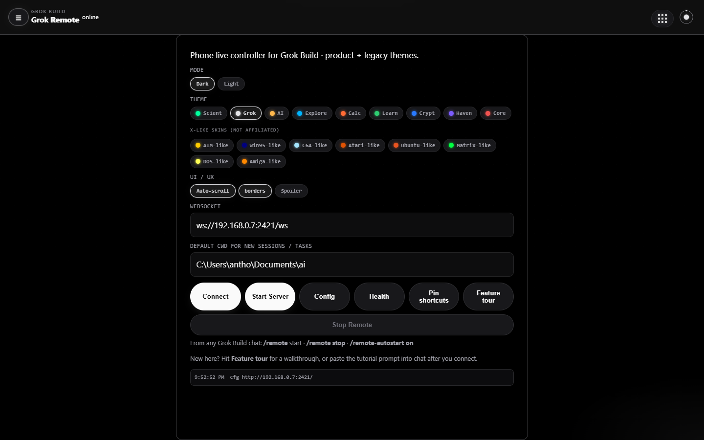 | 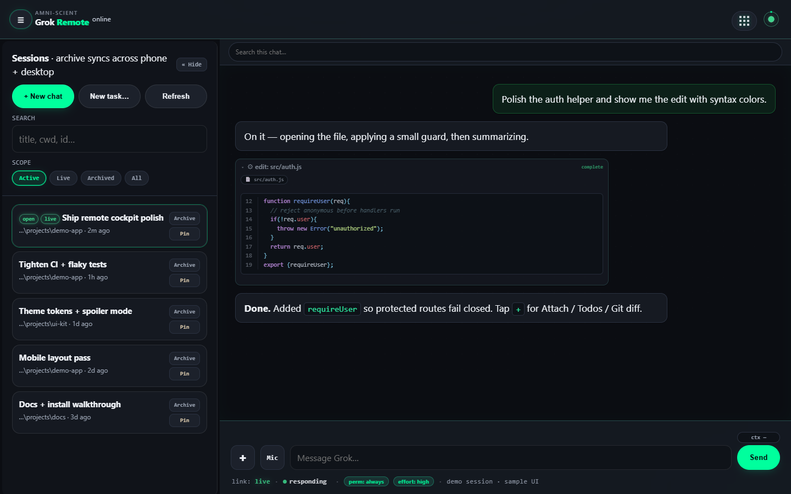 | 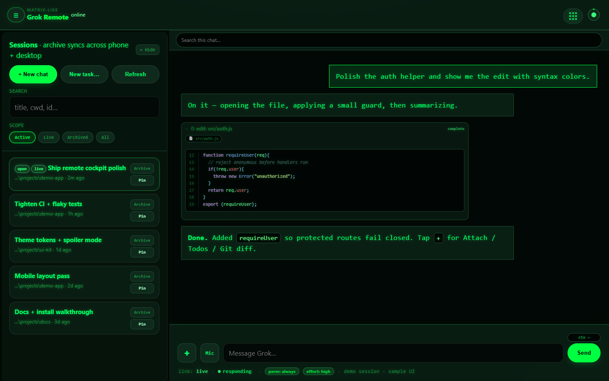 |

| Ubuntu | Commodore | Grok light |
|--------|-----------|------------|
| 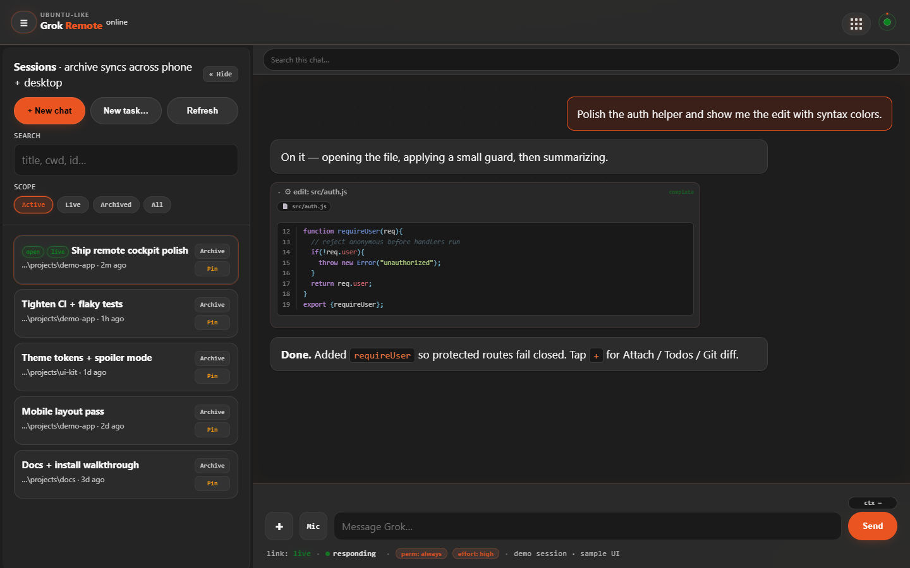 | 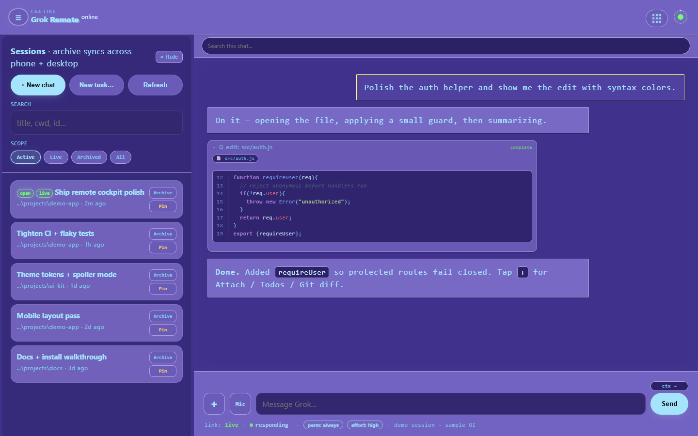 | 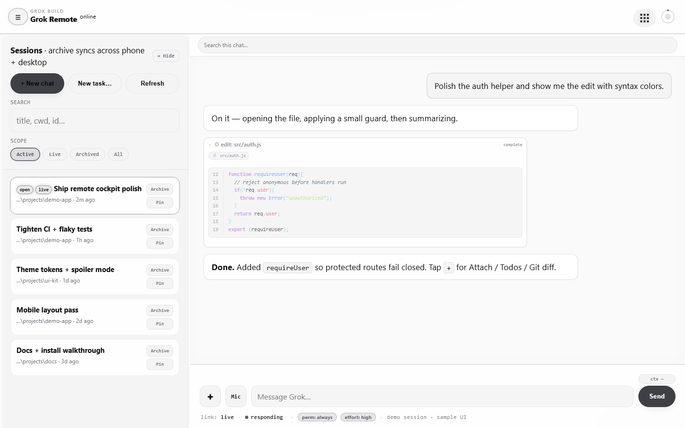 |

### Spoiler mode

Blur titles, paths, and IDs for safe sharing. Desktop: hold **Alt** to peek. Phone: private-screen badge.


### Phone

| Chat (Grok) | Command deck | Spoiler | Scient skin |
|-------------|--------------|---------|-------------|
| 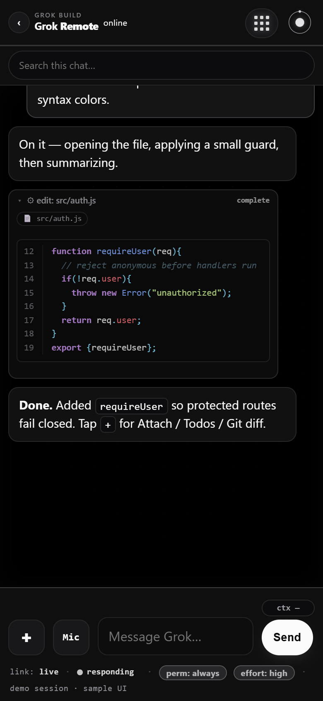 | 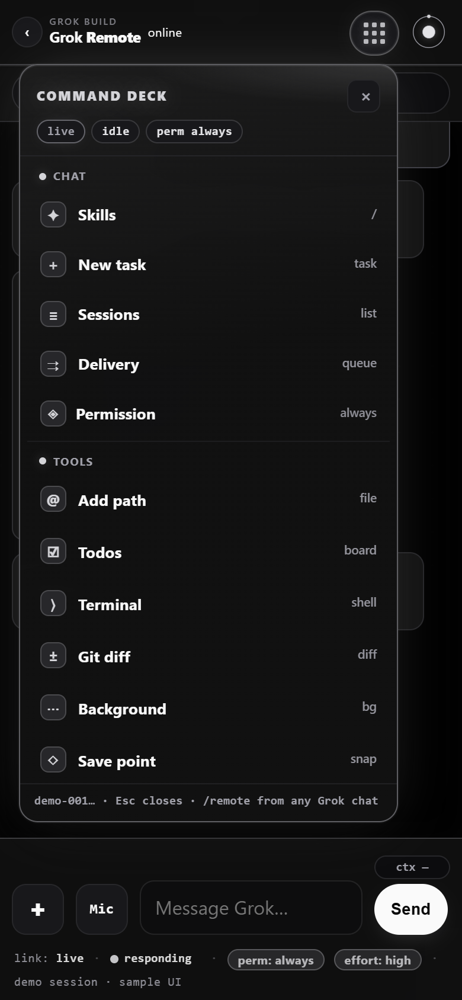 | 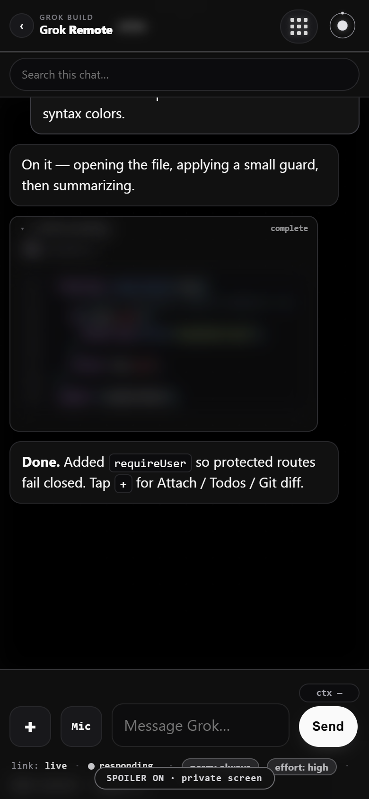 | 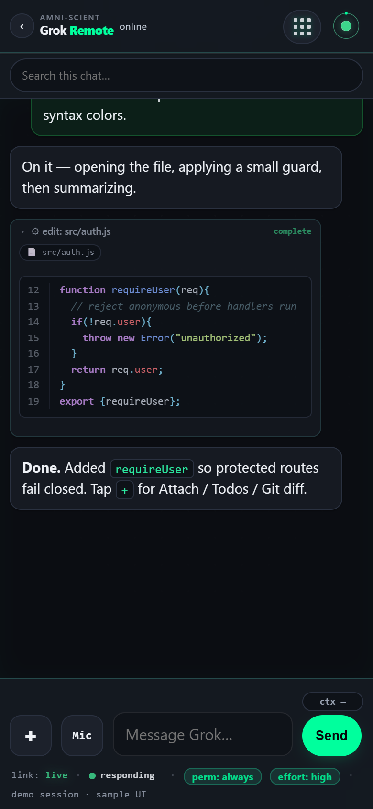 |

---

## Features

| Area | What you get |
|------|----------------|
| **Sessions** | List, open, archive (device-local), live vs historical |
| **History** | Disk-first chat paint; scroll up for older turns; clean You bubbles (no instruction chrome) |
| **Live stream** | ACP updates + disk catch-up for PC-side prompts |
| **Composer** | Attach (**+**), Mic / XR, Interject · Queue · FYI when busy, Cancel |
| **Command deck** | Skills, task, permission cycle, tools, hide/collapse, IDE, persona, watch, Delve, theme, tour |
| **Orbit** | Start / stop remote stack + health |
| **`/effort`** | `low` · `medium` · `high` · `xhigh` (livebar chip or slash) |
| **`/loop`** | Hub scheduler — fires on the open session **without** a CLI window; `/loops` · `/loop stop` |
| **Skills** | Agent + disk skill palette |
| **Themes** | Grok greyscale default + Scient + retro gallery |
| **Spoiler** | Privacy blur for screenshots |
| **Desktop app** | Optional Electron cockpit + IDE + Grok Review |

---

## Quick start

### From Grok Build

```
/remote
```

### Manual

```powershell
cd path\to\grok-remote
.\start.ps1 -Cwd path\to\your\project
```

### Desktop app (Electron)

```powershell
cd desktop
npm install
npm start
```

Details: [desktop/README.md](./desktop/README.md)

---

## Architecture

```
Phone / browser  ──HTTP──►  UI + hub  :2421
                 ──WS /ws─►  multi-client hub  ──►  grok agent serve  127.0.0.1:2419
                                                         │
                                                    tools / files on PC
```

- **Hub** fans out one agent to many clients (phone + desktop).
- **`/loop`** jobs live under `~/.grok/plugin-data/grok-remote/loops.json` and fire via the hub.
- Prefer same Wi‑Fi / VPN; don’t expose the agent to the open internet without care.

---

## Auto-start (optional)

```powershell
powershell -File .\scripts\install-autostart.ps1 -Cwd path\to\project
powershell -File .\scripts\install-autostart.ps1 -Boot -Cwd path\to\project
powershell -File .\scripts\install-autostart.ps1 -Disable
```

Or in TUI: `/remote-autostart on` · `boot` · `off` · `status`

Config: `~/.grok/plugin-data/grok-remote/config.json` (default **off**).

---

## Safety

- Never `Stop-Process -Name grok` (kills every Grok session on the machine).
- `/remote-stop` only stops remote UI + remote agent serve.
- Public docs and screenshots use **`?demo=1`** only — no real session titles or machine paths.

---

## Develop & screenshots

```powershell
.\start.ps1 -Cwd .
# then, with UI on :2421:
node scripts/capture-screenshots.mjs
```

Writes `docs/screenshots/*.png` from **demo mode** (Grok + theme gallery + phone). Requires Chrome + `playwright-core`.

See [CONTRIBUTING.md](./CONTRIBUTING.md) and [architecture_map.md](./architecture_map.md).

---

## Docs

| Doc | Purpose |
|-----|---------|
| [PUBLISH.md](./PUBLISH.md) | Plugin install & marketplaces |
| [skills/remote/SKILL.md](./skills/remote/SKILL.md) | `/remote` skill |
| [changelog.md](./changelog.md) | Release notes |
| [architecture_map.md](./architecture_map.md) | Layout & privacy |

---

## License

MIT — see [LICENSE](./LICENSE).
