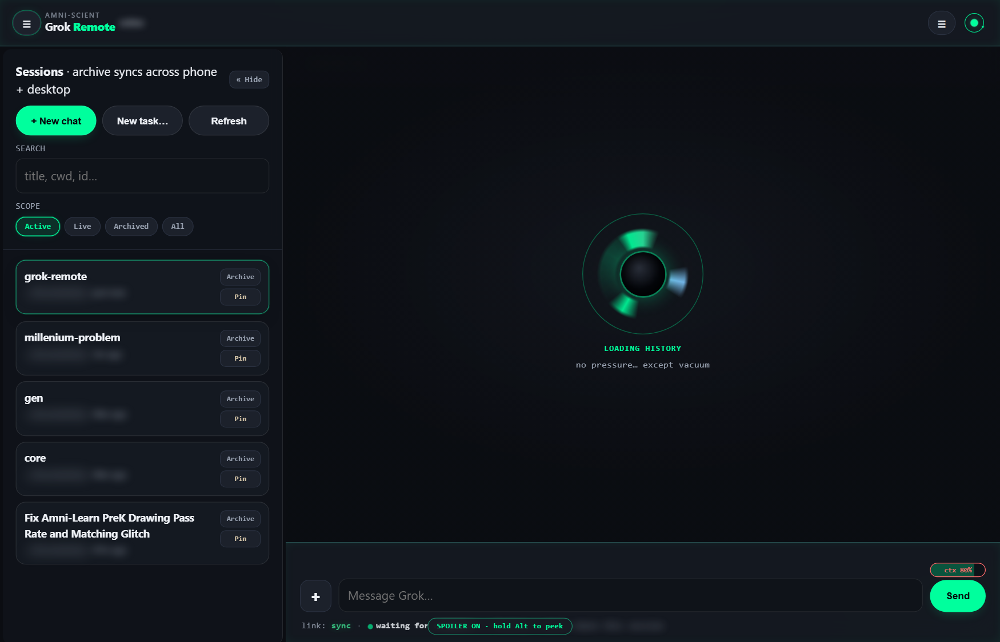
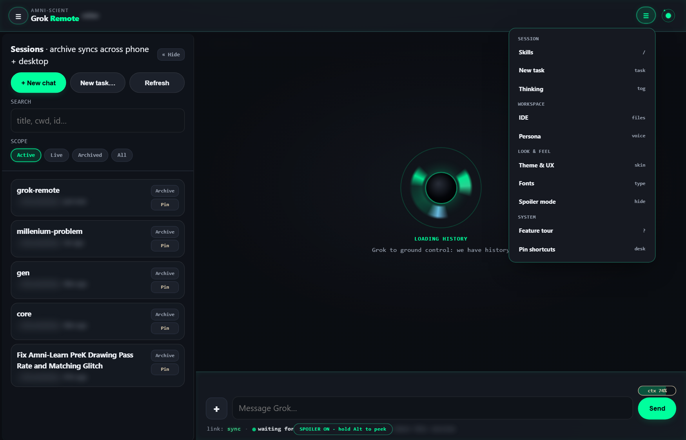
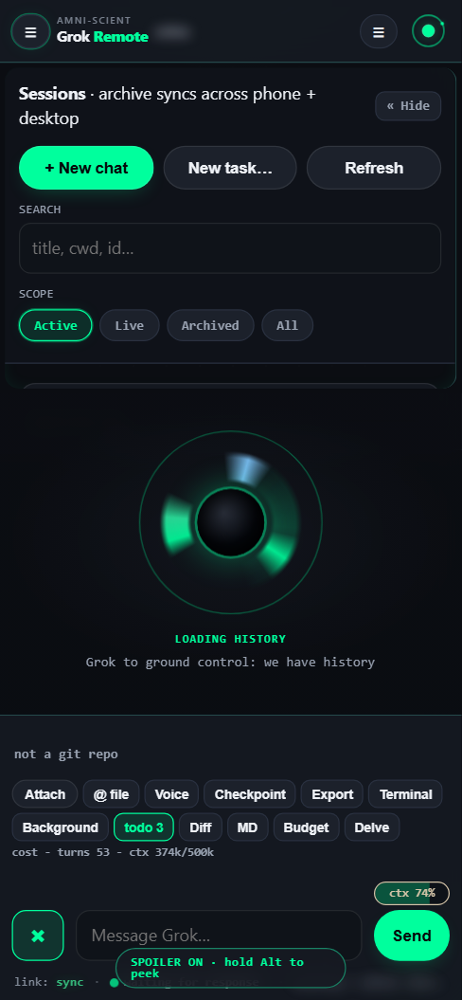
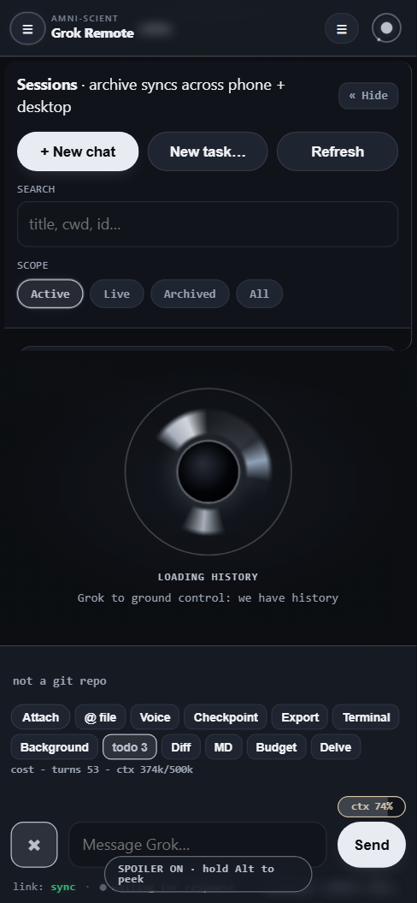
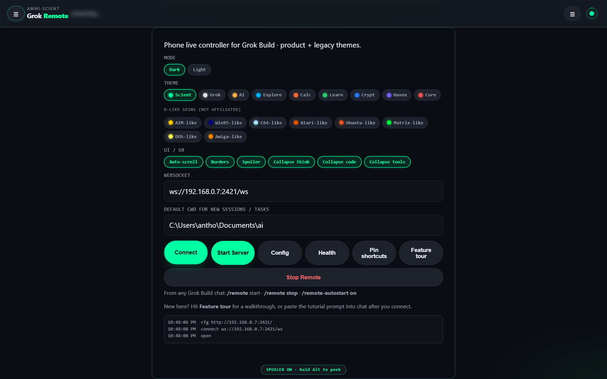

# Grok Remote

**Live phone/browser controller for [Grok Build](https://x.ai)** — control your PC agent from Android (or any browser) over the LAN.

**Repo:** https://github.com/Amnibro/grok-remote  

**Plugin:** `/remote` · `/remote-stop`

## Install (anyone)

```bash
grok plugin install Amnibro/grok-remote --trust
grok plugin enable grok-remote
```

Pin a version:

```bash
grok plugin install Amnibro/grok-remote@v1.1.0 --trust
```

In the TUI, reload plugins if needed (`/plugins` → `r`), then:

```
/remote
```

Open the printed URL on your phone (same Wi‑Fi), e.g. `http://192.168.x.x:2421/?auto=1`.

## Screenshots

Spoiler mode blurs paths, session IDs, and sensitive chips for safe sharing (hold **Alt** to peek).

### Desktop cockpit (Scient · dark · spoiler on)



### Hamburger menu



### Composer tools tray (`+`)


### Phone

| Scient | Grok mono |
|--------|-----------|
|  |  |

### Connect / themes screen



## What you get

| Feature | Detail |
|---------|--------|
| Session picker | List + load desktop / historical chats (`resident` = live) |
| Full history | Messages, thinking, tools, plans, recaps on load |
| Live stream | ACP updates + ~0.8s catch-up for PC-side prompts |
| Skills | Quick slash-command palette |
| New Task | New session at a stated cwd + optional first prompt |
| Back swipe | Returns to Sessions (does not leave the site) |
| One phone URL | UI proxies WebSocket; agent secret stays on the PC |
| Auto-scroll | Follow latest messages; **↓ Bottom** FAB always in chat |
| Collapse regions | Thinking / fenced code / tools start collapsed (toggle in Theme → UX) |
| Borders vs clean | Bordered cards or clean edge accents — same Theme → UX sheet |
| Themes | Product (Scient, Grok, …) + X-like skins (AIM-like, Win95-like, Ubuntu-like, …) × light/dark |
| Diff UX | Inline red/green hunks; Accept applies via FS API |
| @ files | Browse workspace and attach paths/content to prompts |
| Plan UI | Approve / edit / hold plan steps |
| Permissions | One-tap allow/deny + Always for session |
| Terminal pane | Live shell-like tool output stream |
| Background | Task list + cancel + optional notifications |
| Search / export | Chat search; HTML export with spoiler |
| Voice | Push-to-talk (browser SpeechRecognition) |
| Pins / budget | Pin live sessions; soft turn/token budgets |
| Delve | Launch local Amni Delve hub if running |
| Session archive | Per-chat Archive/Unarchive (device-local); scope Active/Live/Archived/All |
| Search | Filter sessions by title, cwd, id |
| Split scroll | Session list and chat scroll independently |
| Markdown chat | Headings, lists, tables, **theme-colored code**, links, path chips |
| Attachments | 📎 photos/files (drag-drop/paste); images + text/code to agent |
| Collapsible rail | Hide/show sessions sidebar (desktop); edge tab to reopen |
| Flyout menus | Theme / Skills / Task slide in from the top-right (frosted) |

UX prefs: `grok_remote_ux` · archived ids: `grok_remote_archived` (this device only).

## Manual start (without the plugin)

```powershell
cd path\to\grok-remote
.\start.ps1 -Cwd C:\path\to\your\project
```

## Architecture

```
Phone browser  --HTTP-->  UI+proxy :2421
               --WS /ws-->  (proxy) --> grok agent serve 127.0.0.1:2419
                                              │
                                         tools / files on PC
```

## Desktop app (Electron) — no terminal required

Cockpit that **starts Grok agent + UI for you**, with **built-in IDE** and **Grok Review**.

```powershell
# one-time
cd desktop
npm install

# daily launch (or double-click scripts\launch-desktop.cmd)
npm start
```

| Feature | Detail |
|---------|--------|
| Auto stack | Agent `:2419` + UI `:2421` on launch |
| New sessions | From UI / menu — no TUI needed |
| IDE | File tree, edit, save to PC workspace |
| Grok Review | Structured bug-check prompt after edits |
| Phone | Same stack on LAN `:2421` |

Details: [desktop/README.md](./desktop/README.md)

## Auto-start (optional)

When **enabled**, Grok-Remote can start itself:

| Mode | When |
|------|------|
| **Session** (default if on) | Every new Grok TUI/session (`SessionStart` hook) |
| **Boot** | Windows logon (`GrokRemoteAutostart` scheduled task) |

```powershell
# Enable for Grok session start (idempotent; skips if already healthy)
powershell -File .\scripts\install-autostart.ps1 -Cwd C:\Users\antho\Documents\ai

# Also start at Windows logon
powershell -File .\scripts\install-autostart.ps1 -Boot -Cwd C:\Users\antho\Documents\ai

# Disable
powershell -File .\scripts\install-autostart.ps1 -Disable
```

Or in TUI after plugin install: **`/remote-autostart on`** · **`/remote-autostart boot`** · **`/remote-autostart off`** · **`/remote-autostart status`**

Config lives in `~/.grok/plugin-data/grok-remote/config.json` (`autostart`, `autostart_on_session`, `autostart_on_boot`, `cwd`, ports). Default is **off** until you enable it.

## Safety

- Prefer same Wi‑Fi / VPN; don’t expose the agent to the open internet without care.
- Never `Stop-Process -Name grok` (kills every Grok session on the machine).
- `/remote-stop` only stops remote UI + remote agent serve.

## License

MIT — see [LICENSE](./LICENSE).

## Docs

- [PUBLISH.md](./PUBLISH.md) — marketplaces and distribution
- Plugin skill: `skills/remote/SKILL.md`
